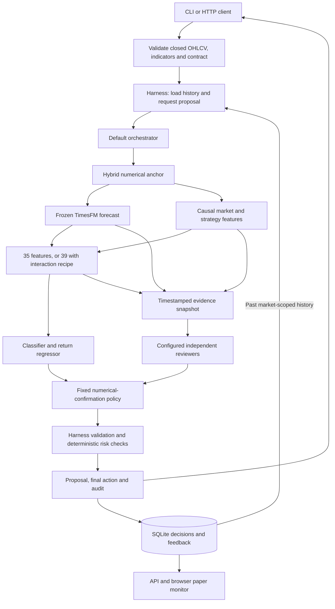
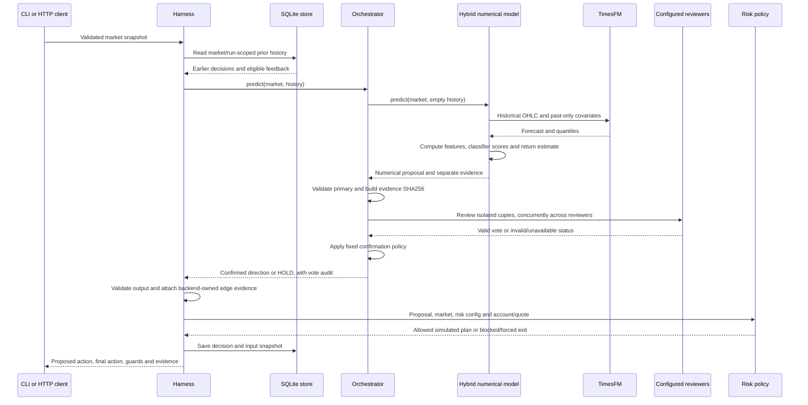
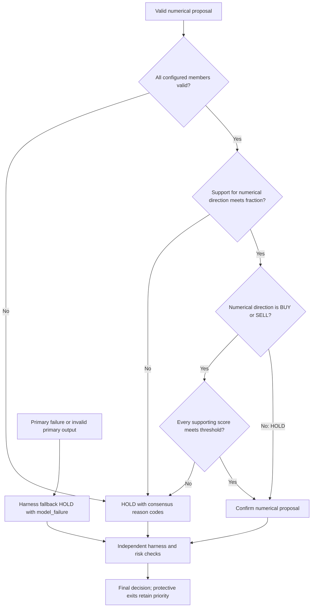
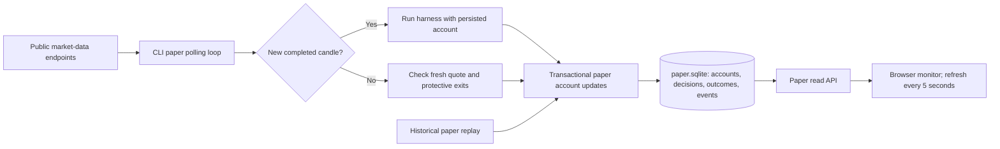
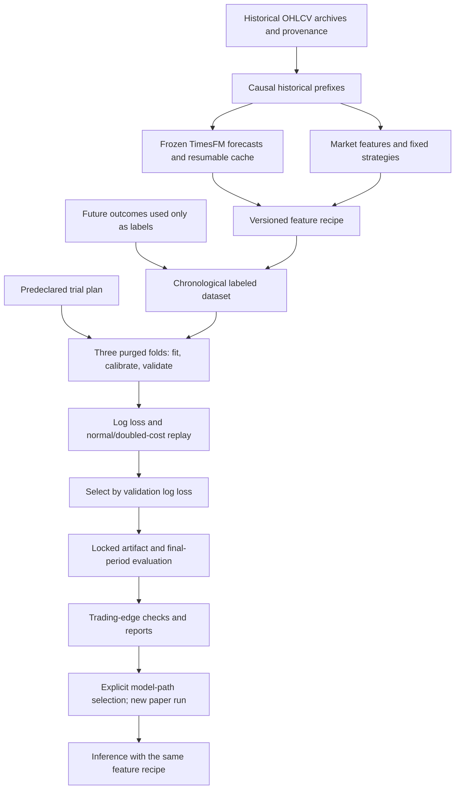
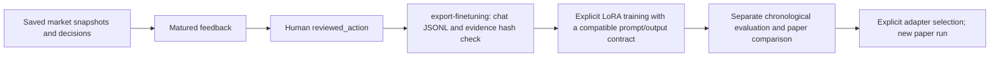
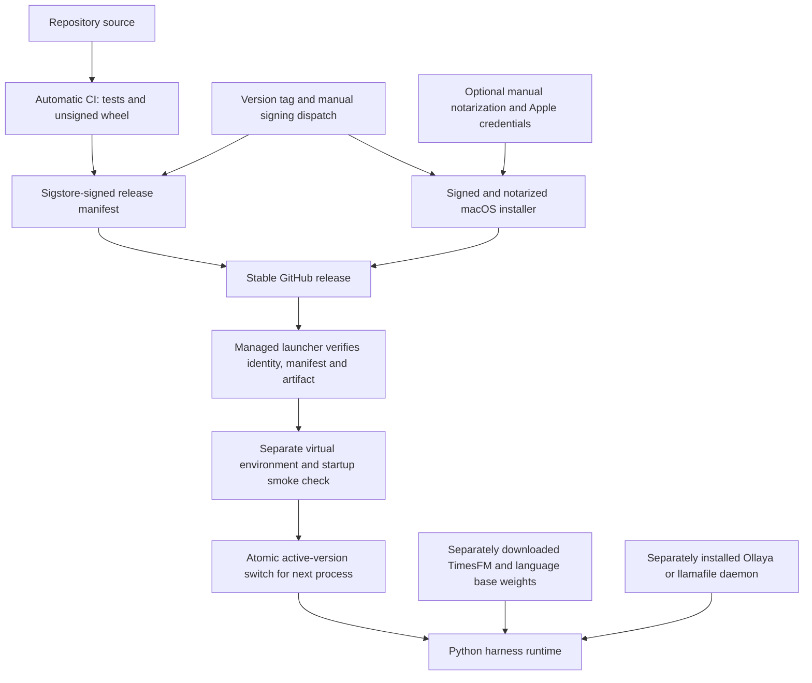

# Architecture and decision lifecycle

Trade Harness is a Python application for trading recommendations and simulated accounts. Its default orchestrator connects a trained numerical decision model with independent language or typed decision reviewers. It returns a proposal, an audit of the evidence and votes, and a final action after deterministic checks. The CLI and HTTP API use the same backend factory and harness; the browser dashboard reads persisted paper-account results.

The application supports long/cash decisions: BUY can enter a long, SELL can close one, and HOLD abstains. It has no exchange-order connector. Every response sets `real_execution_enabled: false`, including research simulations and any future validated model.

## Read the documentation by task

| Task | Guide |
| --- | --- |
| Install and make a first decision | [README](../README.md#start) |
| Configure reviewers and consensus | [Orchestration](orchestration.md) |
| Understand features, strategies and numerical training | [Hybrid decisions](hybrid-decisions.md) |
| Run local typed decision models | [Ollaya integration](ollaya.md) |
| Understand the forecast inputs and checkpoint | [TimesFM](timesfm.md) |
| Interpret measured trading quality | [Trading validation](trading-validation.md) |
| Package a local language runtime | [Distribution](distribution.md) |
| Build, sign and update the application | [Releases and updates](releases-and-updates.md) |

## Runtime components

The arrows represent calls or data dependencies. The numerical anchor is mandatory. One to three reviewers are configured; the default is `local-llm`. Ollaya, Nimble, an OpenAI-compatible server, or a dedicated llamafile server can supply optional reviews. These reviewers are peers: one review is not fed into another.

The evidence snapshot contains the TimesFM forecast, strategy signals, numerical feature values, timestamp, symbol, timeframe, horizon and position. It excludes the numerical model's action and direction probabilities. Reviewers receive isolated copies of this evidence and supported market context, plus eligible past history. The numerical model itself currently ignores decision history; history is context for reviewers rather than a fitted numerical feature.

### Model roles and ownership

| Component | Produces | Training or configuration | Role in a default decision |
| --- | --- | --- | --- |
| TimesFM 3.0 | Independent OHLC-channel forecasts; close-return point and quantile range | Frozen pinned foundation checkpoint; hybrid context fixed to its artifact, currently 100 candles | Supplies evidence and five forecast features; its standalone rule action is not used as a vote |
| Strategy module | Trend, breakout, mean-reversion and no-trade hypotheses | Fixed versioned rules | Supplies four signals and eight features; strengths are heuristic |
| Hybrid numerical anchor | BUY/SELL/HOLD distribution and fitted return forecast | Logistic classifier, Ridge regressor, train-only scaling and later temperature calibration | Supplies the direction that reviewers may confirm |
| Local SmolLM2 adapter | Candidate-label likelihood scores | Shipped BTCUSDT/1h/3-candle LoRA | Default reviewer; extended shared-evidence prompt was not part of its original training |
| Ollaya | Typed direction distribution and advisory evidence-sufficiency score | Separately pulled decision model; concrete manifest recorded | Optional reviewer; rejects incomplete/truncated state |
| Clef / Clef-Flash | Native direction distribution and advisory evidence/risk scores | Workers AI alias or separately hosted immutable backbone/joint-head snapshot | Optional reviewer; native examples, bounded input and provenance checks; no measured trading edge |
| Other reviewer adapters | Validated language or typed proposal | Separately configured model/server | Optional reviewers under the same confirmation policy |
| Harness and risk policy | Final allowed action, sizing, stops, reason codes and typed rule fields | Deterministic code and `RiskConfig` | Owns output validation and simulated eligibility, not learned voting |

**Two different forecasts appear in a hybrid/orchestrator response.** `forecast` is the numerical anchor's fitted return estimate and projected close. `forecast_evidence` is the separate TimesFM forecast used as input. They can disagree. Forecast projections are never appended as observed candles. Reviewers cannot replace the anchor's return forecast. `strategy_signals` and `feature_evidence` expose additional inputs rather than executable orders.

Model score calibration is also separate from trading validation. A temperature fitted on chronological classification data does not establish profitable returns. The ensemble has no calibrated combined probability distribution; member scores remain in `consensus.votes`.

### Incoming and outgoing typed APIs

| Interface | Direction | Contract |
| --- | --- | --- |
| Harness `POST /decisions` | Client to this application | `MarketInput` arrays to a full audited `Decision` |
| Harness `POST /v1/systemone` | Client to this application | Fixed trading questions over a market state; arbitrary custom classifications/instructions are not supported |
| Ollaya `POST /api/decide` | Harness to a separate daemon | Independent direction and evidence-sufficiency questions, with truncation and concrete-model checks |
| Nimble `POST /v1/systemone` | Harness to a configured service | Typed reviewer questions; numerical forecast supplied by the harness |
| Clef Workers AI or self-hosted `POST /v1/systemone` | Harness to a native decision service | Versioned direction/evidence/risk questions; hosted aliases cannot certify pinned forward experiments |
| OpenAI-compatible chat endpoint | Harness to a configured service | JSON proposal through the existing Chat Completions adapter |

The incoming trading API and external reviewer APIs serve different roles. Ollaya is a local decision-model runtime, while the Python orchestrator owns multi-model confirmation and the application owns risk and persistence.

## One request, step by step

Malformed input is rejected before model inference (HTTP 422 for the API, a validation error for the CLI). Input arrays must align, OHLC bounds must be valid, timestamps must increase, and the selected artifact's asset/timeframe/horizon contract must match. TimesFM additionally requires regularly spaced closed candles. Trained decision artifacts reject inference timestamps that overlap fit or calibration. Caller-provided indicators must be causal; the schema cannot detect future information hidden in those values.

History is isolated by market and, for paper accounts, run scope. Reviewers see only earlier decisions. Feedback must mature after the forecast horizon to be stored, and its observation time must be strictly before the new snapshot before it enters reviewer context. Future realized returns never enter the current evidence snapshot.

### Consensus and failure handling

The default requires unanimous agreement and a supporting score of at least 0.55 for directional proposals. A custom agreement fraction must exceed 50%. All configured reviewers must still return valid output; an unavailable reviewer never reduces the denominator. A reviewer majority cannot overturn the numerical direction. Duplicate local LoRA/llamafile family votes, and Nimble counted separately from Nimble served through Ollaya, are rejected.

Accepted consensus uses the minimum supporting score as a heuristic aggregate score. It does not average probabilities or treat members as statistically independent. An accepted HOLD remains subject to ordinary harness checks and can carry low-confidence guards. A rejected consensus adds `consensus_not_reached`. A primary exception produces a fallback with `model_failure`; that path cannot promise a complete member audit.

Risk policy is independent of model availability. With a valid account and usable quote, a protective SELL can override a low-confidence, failed or abstaining model. A stale quote still blocks a simulated protective fill. A request with `position: long` but without the actual account snapshot cannot reconstruct entry price, units or stops; use the persistent paper engine for account-aware decisions.

## Understanding the response

| Field | Meaning |
| --- | --- |
| `proposed_action` | Backend proposal after consensus, before harness/risk checks; inspect the numerical vote for the original anchor action |
| `action` | Final action allowed by checks; a protective exit can differ from the proposal |
| `confidence` | Selected choice score for a standalone probabilistic backend; heuristic minimum supporting score for accepted consensus |
| `probabilities` | Optional backend distribution; absent for aggregate consensus |
| `forecast` | Backend return estimate, horizon and projected price; numerical regressor in the hybrid path |
| `forecast_evidence` | Separate TimesFM input evidence, with timestamp, version and quantile return range |
| `strategy_signals`, `feature_evidence` | Hypotheses and numerical values used by the hybrid model |
| `consensus.votes` | Configured member status, action, score, version, evidence hash and provider details |
| `trading_validation` | Artifact-owned evidence bound to model, asset, timeframe and horizon; missing evidence cannot establish edge |
| `guardrails`, `execution` | Block/exit reasons and the deterministic simulated plan |
| `fields` | Typed decision/rule outputs with sources; deterministic one-hot rule fields are not market probabilities |

For example, a numerical BUY with a disagreeing reviewer becomes a consensus HOLD. A unanimous BUY can still become final HOLD because the model has no validated edge, net expected return is too small, or account limits are reached. A protective stop can produce final SELL even when both models propose HOLD.

The default orchestrator remains `research_only` and does not inherit its numerical anchor's validation. Default risk policy blocks research-model BUY entries. `--research` permits simulated entries for investigation while preserving other checks; it neither certifies edge nor enables real orders.

## Paper accounts and the dashboard

The paper engine persists capital, exposure, stops, pending orders, fills, decisions and matured outcomes. It updates an account transactionally and deduplicates processed signals/ticks. Resuming the same run reuses its state; changing model version, market or risk configuration requires a new run ID.

Historical replay fills a pending signal at the next candle's open, with fees and slippage. A missing next bar cancels it; stop/target collisions assume the stop was hit first. Live paper polling uses fresh quotes for simulated fills and protective exits. The browser displays these persisted events; it does not run inference or place orders. CLI decisions normally use `decisions.sqlite`, while paper runs/dashboard normally use `paper.sqlite`; select the same database when exporting feedback from a paper run.

## Offline learning and feature experiments

`tune-hybrid` tests bounded numerical settings offline: feature recipe, classifier regularization C and Ridge alpha. Base, interaction, and quant recipes have 35, 39, and 45 features. The default registry has twelve trials and reports paired validation-fold differences. Scaling fits only on training data; temperature calibration uses a later separate partition. Labels crossing segment boundaries are purged. Final-period outcomes cannot select the winner or promote validation. The original eight-trial run produced no positive trading edge and did not activate its tuned artifact.

This is parameter fitting for the numerical layer. It does not fine-tune TimesFM or language weights, change live risk limits, generate executable strategy code, or maximize agreement. The [hybrid guide](hybrid-decisions.md) describes forecast caching and sparse decision sampling; the [orchestration guide](orchestration.md) gives reproducible tuning commands.

### Reviewed language training is a separate workflow

Consensus is not a training label. The exporter uses human-reviewed actions as targets and retains recorded shared evidence in the user prompt when available. Future realized returns stay outside the prompt. The generic chat trainer is available separately; exporting examples does not make its resulting adapter interchangeable with the shipped compact candidate-scoring adapter or an Ollaya decision head. Deployment requires a matching inference adapter and evaluation. The shipped local reviewer has not been retrained on the extended evidence prompt.

Matured outcomes entering history are context updates, not automatic online learning. There is no background training job or self-modifying strategy loop.

The [contextual research workflow](research-workflow.md) separately trains a position-aware reviewer using the actual shared-evidence prompt, purged next-open outcome labels, and a later calibration partition. It evaluates the complete consensus and risk policy against matched baselines. Fresh promotion evidence is collected only after declaring fixed model/code/risk identities. The original shipped compact reviewer is retained until a candidate earns activation through an explicit, evidenced decision.

## Deployment and update boundaries

The wheel includes Python code, numerical artifacts, dashboard assets and the shipped LoRA adapter. Foundation base weights and optional external runtimes remain separate; the harness release signature does not cover their installations. TimesFM 3.0 research-use restrictions remain applicable. Apple notarization is prepared and requires configured credentials. Automatic builds are unsigned; signing/publication requires an explicit manual release run on a matching version tag.

Only `trade-harness-managed` performs automatic startup update checks. Updates stage an isolated environment and retain the previous version on failure. The startup smoke check loads the lightweight numerical backend and imports the API; it does not verify all external inference servers or download every foundation model. Running processes use their existing code until restarted. Updates do not retrain models or reset paper accounts.

## Implementation map

| Responsibility | Main source |
| --- | --- |
| CLI, HTTP API and backend selection | [cli.py](../src/trade_harness/cli.py), [api.py](../src/trade_harness/api.py), [models.py](../src/trade_harness/models.py) |
| Input/output contracts and typed fields | [schemas.py](../src/trade_harness/schemas.py), [typed.py](../src/trade_harness/typed.py) |
| Proposal validation, fallback and persistence | [harness.py](../src/trade_harness/harness.py) |
| Shared evidence and confirmation policy | [orchestrator.py](../src/trade_harness/orchestrator.py) |
| Forecasting, strategies and features | [timesfm_model.py](../src/trade_harness/timesfm_model.py), [strategies.py](../src/trade_harness/strategies.py), [hybrid.py](../src/trade_harness/hybrid.py), [feature_engineering.py](../src/trade_harness/feature_engineering.py) |
| Numerical fitting and experiments | [learning.py](../src/trade_harness/learning.py), [hybrid_training.py](../src/trade_harness/hybrid_training.py), [experiments.py](../src/trade_harness/experiments.py) |
| Reviewer adapters | [local_language.py](../src/trade_harness/local_language.py), [ollaya.py](../src/trade_harness/ollaya.py), [nimble.py](../src/trade_harness/nimble.py), [llamafile_model.py](../src/trade_harness/llamafile_model.py) |
| Paper accounts, risk and temporal history | [paper.py](../src/trade_harness/paper.py), [risk.py](../src/trade_harness/risk.py), [storage.py](../src/trade_harness/storage.py) |
| Edge evidence and managed updates | [validation.py](../src/trade_harness/validation.py), [updater.py](../src/trade_harness/updater.py) |

Current reports distinguish [parameter experiments](../reports/parameter-experiments.md), the [small local-reviewer audit](../reports/consensus-comparison.json), and [Ollaya connectivity smoke tests](../reports/ollaya-smoke.json). None establishes a profitable ensemble. New strategies, model weights, reviewer membership or quantization change the evaluated system and require their own comparison on fresh periods.
