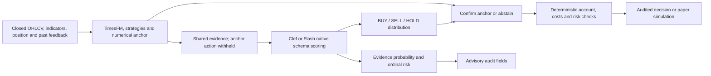
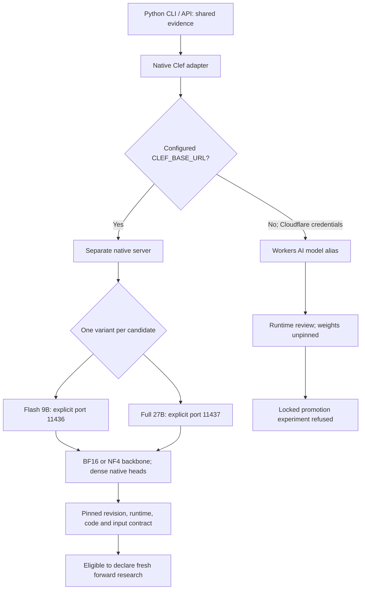
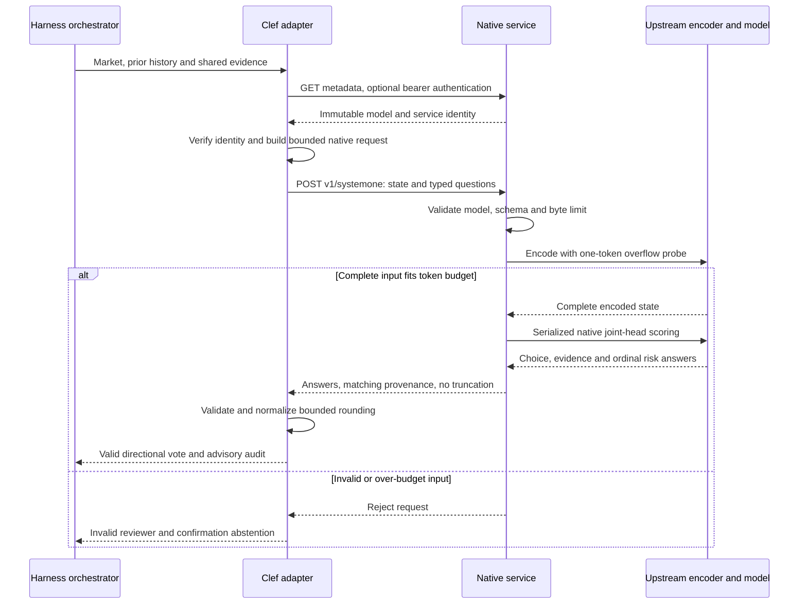
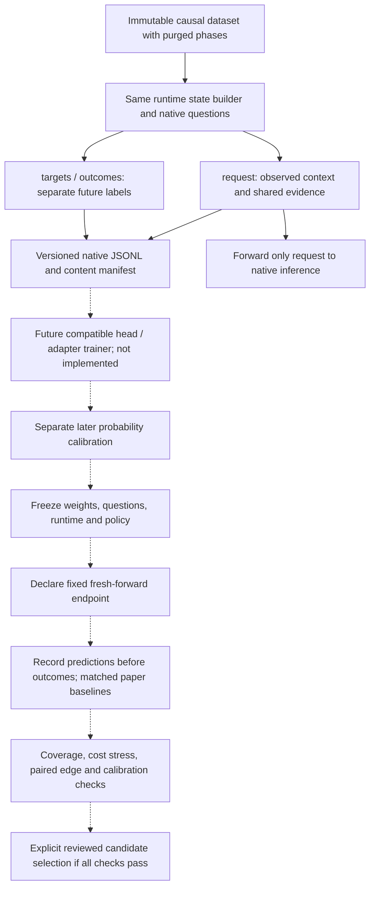

# Clef native decision review

[Clef](https://huggingface.co/Cloudflare/clef) and [Clef-Flash](https://huggingface.co/Cloudflare/clef-flash) score typed options with a joint schema head after a backbone prefill. They produce `choice`/`noul`/`score` answers without generating free-form JSON token by token. Both model cards declare Apache-2.0. Preserve upstream licensing when redistributing weights; the harness does not bundle them.

The [announcement](https://blog.cloudflare.com/clef-decision-models/) reports better results than Jev on many tasks, including BANKING77, ContractNLI, and ForecastBench, and weaker results on others, including GPQA Diamond and MMLU-Pro. BANKING77 measures banking intent classification, FinEntity measures financial entity tasks, and ForecastBench measures general event forecasts. None measures profitable OHLCV trading. These are publisher-reported comparisons, not harness measurements.

| Variant | Model card backbone | Parameters | Approximate BF16 backbone weights | Publisher median latency |
|---|---|---:|---:|---:|
| Clef | Qwen3.8-27B | 27.36B | 54.7 GB | 209.3 ms |
| Clef-Flash | Qwen3.5-9B | 9.41B | 18.8 GB | 38.8 ms |

Memory also needs the joint head, activations and runtime overhead. The local model card reports testing on an H200. Publisher latencies do not establish latency for our network, state size or account pipeline. Clef is a useful quality challenger; Flash is a useful latency challenger. Both remain unvalidated trading reviewers.

## Architecture and score semantics



The state includes up to 100 aligned closed candles, volume/indicators, fixed features/strategies, uncertain forecast intervals, flat/long position, and eligible past feedback. `CLEF_CONTEXT_CANDLES` declares a raw trailing window of 21–100 candles, default 100; `input_scope` records the available and forwarded lengths. Features and forecasts retain their independently recorded causal history. The chosen raw context and request timeout enter the reviewer identity. It includes default research fee/slippage/minimum-edge assumptions; actual account costs and risk rules are enforced separately. Reference assumptions do not override custom paper risk configuration. Future labels, current numerical action, and numerical direction probabilities are withheld.

Three versioned questions return a direction distribution, advisory evidence-sufficiency probability, and advisory expected risk level on a four-level scale. BUY considers entering a flat account; SELL considers closing a long; shorting is unsupported. Advisory scores are retained in `review_details`, not used as extra votes or replacements for measured risk. Confidence is derived from normalized direction probabilities. Scores remain **uncalibrated for trading** until measured separately on earlier data.

The adapter validates model identity, question IDs/types, option sets, selected choice, finite probabilities, and expected ordinal score. Native four-decimal rounding is normalized within a bounded tolerance. Provider failure or invalid output invokes the existing failure-to-HOLD policy. Oversized input is rejected rather than trimming shared evidence. Evaluate Clef and Flash as separate candidates; related family variants cannot inflate one consensus.

## Deployment map and current evidence



Ports identify separate deployments, not model identity; metadata supplies identity. The server default remains Flash/11436, so use explicit `--model clef --port 11437` for full Clef. `CLEF_BASE_URL` selects one service for the configured variant, and must match its metadata. Running two services does not permit two votes from the same family.

| Candidate | Operational evidence | Trading validation |
| --- | --- | --- |
| Flash NF4 on CPU, 21 raw candles | Native request and TimesFM/numerical orchestrator completed; measured native latency 179.35 seconds | No calibrated trading scores or positive edge |
| Flash NF4 on CPU, 100 raw candles | Request exceeded a 240-second client timeout; stopped | No quality conclusion |
| Full Clef 27B, NF4 or BF16 | Pinned launch path and planning checks prepared; insufficient workspace resources for actual loading/inference | Unmeasured |
| Workers AI variants | Adapter contracts tested; no credentialed inference measurement | Unpinned aliases cannot enter locked forward promotion |

These rows describe the recorded verification runs, not continuous service availability. Native GPU inference and full-model quality comparisons still need measurement on the intended host. The [Flash reports](../reports/clef-integration.json) and [full-model resource report](../reports/clef-full-readiness.json) retain their measured scope.

## Workers AI

Set credentials outside the repository using the names in [.env.example](../.env.example). The CLI reads process environment variables; it does not automatically load `.env` files.

```bash
# Configure CLOUDFLARE_ACCOUNT_ID and CLOUDFLARE_AUTH_TOKEN first.
trade-harness decide --backend orchestrator --reviewers clef
trade-harness decide --backend orchestrator --reviewers clef-flash
trade-harness decide --reviewers local-llm,clef

# Native direction with the shipped independent numerical return forecast:
trade-harness decide --backend clef
```

The adapter calls the documented [Workers AI native endpoint](https://developers.cloudflare.com/workers-ai/models/clef/) with a SystemOne request and unwraps `success/result/errors`. It adds no Python dependency; the numerical orchestrator retains its existing optional dependency group. Hosted usage incurs Cloudflare's published charges.

Hosted aliases expose no immutable weight revision, so reports mark them `weights_pinned: false`. They can support research decisions/paper monitoring, but `lock-research` refuses them for promotion experiments. A conservative 32,000-byte complete-request limit keeps input well below the hosted 65,536-token context. The hosted API does not supply independent complete-input attestation.

## Pinned self-hosted service

The model cards tested Torch 2.11 and Transformers 5.10.2. Our existing LoRA environment uses Transformers 4. Keep the native GPU service in a **separate environment**. A generic chat server or ordinary GGUF/llamafile conversion does not preserve Clef's custom joint head.

```bash
python -m venv .clef-venv
.clef-venv/bin/pip install 'torch==2.11.0' 'transformers==5.10.2' \
  'torchvision==0.26.0' huggingface-hub safetensors pillow fastapi uvicorn

# Downloads and loads a pinned backbone plus native joint head; requires enough GPU memory.
PYTHONPATH=src .clef-venv/bin/python -m trade_harness.clef_server \
  --model clef-flash --device cuda --port 11436

# In the harness environment:
CLEF_BASE_URL=http://127.0.0.1:11436 trade-harness decide --reviewers clef-flash
```

Defaults pin Clef revision `2f3de3dd85f379784083b0814d997ab627200f0c` and Flash revision `17f0b0ad64efb65d273590632833508766b2aae6`. Use matching `--revision` and `CLEF_REVISION` for another immutable upstream release. The server executes that snapshot's custom inference code. Optional `CLEF_API_KEY` must match in both processes; metadata and inference require it when configured. Bind address defaults to loopback.

`GET /metadata` records the repository/revision, server source digest, Torch/Transformers versions, token limit and reject-on-truncation contract. The client checks it before initialization and every inference, and requires matching response provenance. Before inference, a one-token overflow probe rejects inputs that the upstream encoder would truncate. GPU inference is serialized. The default context limit is 16,384 tokens; `--max-length` changes it within the documented model limit and becomes part of the pinned identity. This service accepts text/JSON, although the upstream release also supports images/video.

### Native request and failure path



Transport timeout, identity drift and invalid answers also produce an invalid reviewer status. The orchestrator cannot shrink configured membership to hide a failure. The incoming harness trading API and this external native service API have different contracts; see [interface ownership](architecture.md#incoming-and-outgoing-typed-apis).

### Full Clef (27B), alongside Flash

The full model uses the same native service, typed questions, evidence, consensus and deterministic risk checks. Its default revision is pinned independently of Flash. Run it on port **11437** so an existing Flash service on 11436 can stay available. Select one variant per experiment using [the full-model preset](../examples/orchestrator-clef.json).

The pinned full snapshot is **54,989,894,057 bytes across 25 files**, verified from Hugging Face release metadata. NF4 still downloads this original snapshot before quantizing the backbone in memory. Plan at least 61 GB free for the snapshot plus cache margin, with extra storage for the Python environment. The following are conservative planning budgets, not measured full-model peaks: **32 GiB available GPU memory for NF4**, or an **80 GiB GPU for BF16**. CPU NF4 development should plan 48 GiB available RAM; latency remains unmeasured. Context length and loading overhead may require more memory.

```bash
# In the separate GPU runtime prepared above:
.clef-venv/bin/pip install 'bitsandbytes==0.50.2' accelerate

# Inspect hardware before downloading. Exit 0 meets planning budgets; exit 2 does not.
PYTHONPATH=src .clef-venv/bin/python -m trade_harness.clef_server \
  --model clef --device cuda --quantization nf4 \
  --cache-dir artifacts/clef/models --check

# Full 27B model, preserving the native dense lexical/schema heads:
PYTHONPATH=src .clef-venv/bin/python -m trade_harness.clef_server \
  --model clef --device cuda --quantization nf4 \
  --cache-dir artifacts/clef/models --port 11437

# Connect the harness to full Clef, with TimesFM/numerical confirmation:
CLEF_BASE_URL=http://127.0.0.1:11437 CLEF_TIMEOUT_SECONDS=600 \
  trade-harness decide --backend orchestrator --reviewers clef
```

For full BF16, use `--quantization none` in both the readiness and launch commands on a sufficiently provisioned GPU. For CPU development, replace `--device cuda` with `--device cpu` and use the CPU runtime installation below. After caching, add `--offline` to launch. NF4 and BF16 are separate research candidates; switching quantization requires a new declaration and calibration. Do not combine Flash and full Clef into two votes from the same model family.

`--check` performs no snapshot download or inference. It checks available memory, including the remaining Linux cgroup budget on CPU, and fresh-download disk space. Existing cache is deliberately not deducted or verified. Custom revisions have an unknown download size and cannot pass this planning check until separately verified. A passing check does not establish successful loading, latency, calibration or trading edge.

This workspace cannot host the full model: it has 16 GiB RAM, no GPU, and about 5 GiB free after caching Flash. The [full-model readiness report](../reports/clef-full-readiness.json) records that constraint. Full-model inference and training have **not** been run here; Flash has real inference evidence below. A larger GPU host is needed to measure the full candidate against Flash using the same locked forward criteria.

### CPU development with four-bit Flash

The full BF16 Flash backbone exceeds this workspace's 16 GiB memory limit. The native loader also supports an explicitly selected NF4 backbone, keeping `lm_head` dense because the joint head reads its lexical embedding rows. The joint head itself remains floating point. Quantization is recorded in metadata and defines a separate research candidate; its output quality must be evaluated independently.

```bash
python -m venv .clef-venv
.clef-venv/bin/pip install --index-url https://download.pytorch.org/whl/cpu \
  'torch==2.11.0' 'torchvision==0.26.0'
.clef-venv/bin/pip install 'transformers==5.10.2' 'bitsandbytes==0.50.2' \
  accelerate safetensors pillow fastapi uvicorn

PYTHONPATH=src .clef-venv/bin/python -m trade_harness.clef_server \
  --model clef-flash --device cpu --quantization nf4 \
  --cache-dir artifacts/clef/models --threads 4 --port 11436

# Research decision with an explicitly shorter raw window and longer CPU timeout:
CLEF_BASE_URL=http://127.0.0.1:11436 CLEF_CONTEXT_CANDLES=21 \
  CLEF_TIMEOUT_SECONDS=600 trade-harness decide --backend clef-flash
```

The initial download still contains the 19.1 GB original snapshot; quantization happens at loading. Allow disk space for the environment and cache as well. Add `--offline` after the snapshot is cached. CPU paths use ordinary Torch fallbacks when optional optimized kernels are unavailable; no CUDA/Flash-attention extension is required for CPU inference. Torchvision is required by the upstream processor even for text-only requests. `CLEF_TIMEOUT_SECONDS` defaults to 30 and accepts 5–600 seconds. Long research timeouts do not relax quote freshness, risk or forward-capture timing requirements. A suitably provisioned GPU is recommended for full context and time-sensitive paper collection.

## Native examples and fine-tuning

```bash
trade-harness export-clef --dataset artifacts/research/examples-v2.jsonl \
  --backend clef --output artifacts/research/clef-examples.jsonl
```

The full-model export has 2,910 examples with 100 declared raw candles; its [manifest](../reports/clef-full-examples.json) records the source, costs, phase counts and content hash. It is included in the downloadable project bundle. No full-model fine-tuning has been performed.

The exporter converts the immutable multi-asset paired flat/long examples into native `request.state/questions`, separate `targets.direction`, and separate outcomes. It uses the runtime state builder and the same declared `CLEF_CONTEXT_CANDLES`, preserves global train/calibration/validation/test phases and purges, and records source hashes, reference costs and position-aware labels. Forward **only** `request` for inference. No evidence-sufficiency or risk labels are invented from direction outcomes; those need separately defined/reviewed annotation criteria.

This export does not fine-tune Clef, and our SmolLM chat trainer cannot train its joint head. Native training would fit the head/adapters with categorical targets and a probability loss, retain separate later calibration, account for class imbalance and long/cash costs, and record rejected experiments. Cloudflare describes a fine-tuning partner service and planned self-service RL tooling, not a turnkey local trading trainer. Validate labels and simple baselines before optimizing an RL reward; agreement or profit on an already examined period is insufficient.

### Example export, future training and acceptance



Solid export/inference paths exist today. Dashed paths describe work still needed for an accepted, trained Clef candidate. Native head/adapter training is unimplemented; locked forward collection and acceptance tools exist in the harness, but have no accepted Clef evidence. There is no automatic Clef training or activation. BUY/SELL/HOLD targets come from cost-aware flat/long outcomes, not ensemble agreement. Class imbalance and constant HOLD require directional diagnostics. Native export does not supply invented sufficiency/risk targets.

For fresh acceptance, the current three-hour horizon requires a fixed 140-day observation period, five completed windows, at least 100 closed trades, at least 20 effective time blocks, calibrated directional scores and positive paired edge against cash/momentum under normal and stressed costs. All planned assets must qualify under the [complete acceptance criteria](research-workflow.md#acceptance-criteria). An unknown foundation training cutoff blocks certified retrospective chronology even with pinned weights. Current Flash scores are uncalibrated and neither variant meets promotion criteria.

## Evaluation and verification

A release revision is **not** a known foundation training cutoff. `evaluate-research` refuses to label the existing historical period uncontaminated chronological validation for this adapter. A pinned self-hosted snapshot can be locked for [fresh forward observation](research-workflow.md), with the existing cost/stress, calibration, per-asset and fixed-endpoint acceptance criteria. Changed code, questions, weights or risk settings require a new experiment. Snapshot identity alone does not establish calibrated scores or trading edge.

Tests cover both hosted selectors, native rounding/validation, forecast independence, future-feedback exclusion, drift, input overflow, authentication, consensus and failure-to-HOLD behavior. The CPU native export contains 2,910 paired examples across BTC/ETH/SOL, with 1,452 train, 294 calibration, 582 validation and 582 test examples.

Real self-hosted Flash NF4 inference succeeded on one historical BTC snapshot. With 21 declared raw candles and retained feature/strategy/forecast evidence, its 4,595-token request took **179.35 seconds** on four CPU threads and returned HOLD with raw option scores BUY 0.0397 / SELL 0.0197 / HOLD 0.9406. Advisory evidence sufficiency was 0.0418. These are model scores, not measured accuracy or calibrated probabilities. A separate 100-raw-candle attempt exceeded a 240-second client timeout and was stopped. CPU latency is unsuitable for responsive full-context use; use a GPU for that workload. See [native smoke evidence](../reports/clef-selfhost-smoke.json) and [integration status](../reports/clef-integration.json).

The [full orchestrator smoke](../reports/clef-orchestrator-smoke.json) also completed with actual TimesFM/numerical evidence and the local native reviewer. Both members produced valid HOLD votes; the numerical score was 0.3749 and Clef's HOLD score 0.7736. The final result retained the low-confidence guard, `research_only` status and disabled execution. This verifies the integration, not superior decision quality.

These operational smoke tests are not trading benchmarks, new calibration fits or positive-edge results. Real hosted inference remains unmeasured because the workspace has no Cloudflare credentials. The default reviewer remains unchanged, and signing remains manual-only.
