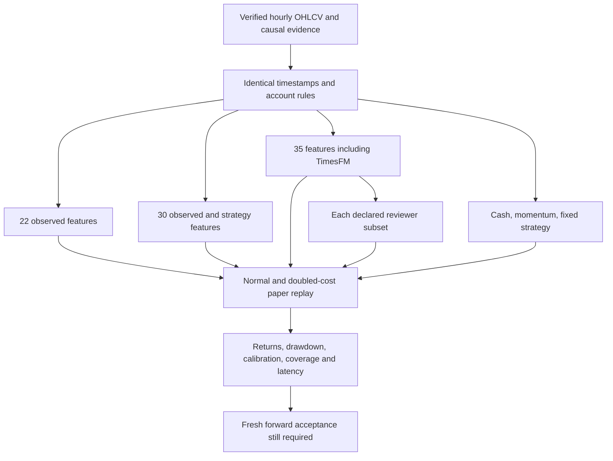
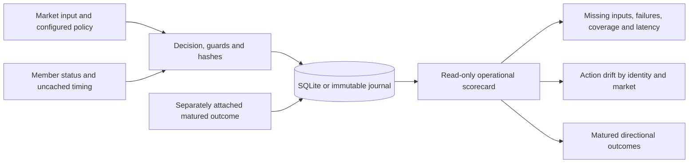

# Evidence, training and operational reliability

Version 0.10.0 implements the six research priorities: matched policy comparisons, native Clef head training, difficult-case exports, past-only reviewer calibration, a manual GPU benchmark workflow, and operational scorecards. These tools make experiments reproducible. They have not established a profitable trading policy, and they do not activate weights or exchange execution.

## What was actually measured

The [controlled comparison](../reports/controlled-ablation.json) uses BTCUSDT, ETHUSDT and SOLUSDT hourly bars, the existing causal TimesFM cache, five purged validation folds and a separate final historical period. Decisions occur every 48 candles, with every intervening bar replayed for fills and account risk. Each asset has its own $10,000 account. Costs are 10 bps fee plus 5 bps slippage per side; a separate run doubles both. Each fold refits and calibrates the numerical candidates on earlier data. The contextual local reviewer remains frozen.

| Candidate | Validation diagnostic return | Closed trades | Directional proposals | Final directional coverage |
| --- | ---: | ---: | ---: | ---: |
| Observed numerical, 22 features | −0.0290% | 4 | 122 | 1.37% |
| Observed numerical + fixed strategies, 30 features | +0.0303% | 3 | 140 | 1.03% |
| Numerical + strategies + TimesFM, 35 features | −0.0535% | 4 | 144 | 1.37% |
| Cash | 0% | 0 | 0 | 0% |
| Momentum | −1.2098% | 60 | 175 | 20.62% |
| Fixed strategy policy | −0.2018% | 28 | 145 | 9.62% |
| Hybrid anchor + contextual local reviewer | 0% | 0 | 0 | 0% |

Return here compounds the mean independent-account return from each reset validation fold. It is a diagnostic, not a continuously funded portfolio return. Coverage is the share of scheduled validation decisions ending in BUY/SELL after the full policy. Protective exits and fills can happen between those decisions. The machine-readable report retains per-asset drawdown, doubled costs, calibration, regime summaries, provider timing, hashes and failed gates.

The small strategy gain has only three trades, and its cash-comparison interval includes zero. The reviewer policy abstains throughout. Neither demonstrates a positive edge. TimesFM did not improve this particular comparison; other data or policies require a separately declared experiment. All seven candidates fail promotion. The final historical period cannot choose a winner or override those failures.

The seven-candidate rerun reuses the previous full run's exact-input reviewer cache. Cache hits are explicit and excluded from provider inference latency. It is not a GPU measurement. Full Clef, Flash and hosted reviewers have not completed this after-cost comparison. Foundation checkpoints with unknown fitting cutoffs cannot claim uncontaminated historical chronology.



## Broader examples and review criteria

Public, checksum-verified DOGEUSDT data adds 23,376 hourly candles from January 2024 through August 2026. The repository now has 93,504 candles across four assets. A real causal TimesFM export produced 970 additional paired flat/long DOGE examples. The current shipped models and the completed benchmark retain their original asset contracts; downloading DOGE does not make those models support it.

The [casebook manifest](../reports/training-casebook.json) records 57 cases: 55 real training cases and two synthetic input fixtures. Real cases cover sideways prices, drawdowns, volatility spikes, existing positions, and gains erased by costs. Synthetic irregular timestamps and invalid OHLC test rejection/guards; they are excluded from supervised market training. These cases remain hourly cryptocurrency examples, not equity sessions or demonstrated cross-timeframe generalization.

```bash
trade-harness review-cases \
  --dataset artifacts/research/examples-v2.jsonl,artifacts/research/doge-examples-v1.jsonl \
  --per-case 8 --output artifacts/research/cases-v2.jsonl
```

Only the train phase is eligible for label review. A reviewer must check that inputs contain no later outcomes; BUY means entry from flat and SELL closes an existing long; the next-open/horizon label accounts for both sides' costs; uncertainty can justify HOLD; and the source candle/forecast contract can be reconstructed. Label discrepancies require an explicit, versioned rationale. A cost-erased tag uses a later outcome and must stay outside inference inputs. Human review is pending, no expert labels are claimed, and reviewed actions are not automatically substituted into training. Reviewing the final test to change rules would consume that test.

## Calibrating a reviewer

Calibration fits a temperature to a declared earlier cohort, preserving the action ordering and independent numerical forecast. It requires at least 30 unique calibration timestamps, complete paired asset/position samples, all three target classes, valid provider results, exact model identity and purged label boundaries. Failed calibration responses stop the fit; they cannot be silently discarded. Repeated positions at one timestamp do not create independent time observations.

```bash
# Use a frozen reviewer that was not fitted on this calibration partition.
CLEF_BASE_URL=http://127.0.0.1:11436 CLEF_CONTEXT_CANDLES=21 \
  CLEF_TIMEOUT_SECONDS=600 trade-harness score-reviewer --backend clef-flash \
  --dataset artifacts/research/examples-v2.jsonl --max-samples 256 \
  --output artifacts/research/flash-scores-v1.jsonl

trade-harness calibrate-reviewer --input artifacts/research/flash-scores-v1.jsonl \
  --output artifacts/research/flash-temperature-v1.json

# Explicit opt-in; this changes the reviewer identity and requires a new declaration.
TRADING_REVIEWER_CALIBRATIONS='{"clef-flash":"artifacts/research/flash-temperature-v1.json"}' \
  trade-harness decide --backend orchestrator --reviewers clef-flash
```

`--max-samples` is the example budget per calibration, validation and test phase; it rounds down to complete timestamps. Scoring hundreds of requests on the measured CPU service would take many hours. Prefer the measured GPU runtime before launching that cohort. No actual Clef calibration cohort has been completed here.

Validation/test results diagnose calibration by class and direction but do not fit temperature. Runtime refuses an artifact with altered hashes, different weights, unsupported market/features, or an inference timestamp at or before its calibration outcomes. Calibration does not resolve an unknown foundation training cutoff or calibrate heuristic consensus confidence. Thresholds remain fixed until a new train/calibration-only experiment declares a change; validation decision-band and regime diagnostics assess whether they generalize. A better log loss alone does not establish an after-cost edge.

## GPU deployment and native training

See [native Clef training and deployment](clef.md#native-examples-and-fine-tuning) for the exact trainer and service commands. The actual Flash NF4 CPU smoke completed one residual-head optimizer step on 4,196,356 trainable parameters with the backbone frozen. That step took 176.58 seconds. No held-out evaluation was requested, so the loss is compatibility evidence only.

The trained head subsequently served one complete native request successfully: 75.26 seconds cold loading, 193.52 seconds HTTP request time, and 14,766,828 KiB peak process RSS. See [training evidence](../reports/clef-head-training-smoke.json) and [service evidence](../reports/clef-trained-head-service-smoke.json). One successful probe cannot estimate sustained p95 latency or accuracy. The earlier full-head CPU attempt was stopped before an optimizer step because of memory pressure.

[Native Clef GPU research](../.github/workflows/clef-gpu-benchmark.yml) runs only through manual workflow dispatch on a user-supplied Linux x64 runner labeled `gpu`. Supply Python 3.11+, a compatible NVIDIA driver, GPU memory and disk appropriate to the selected [planning budget](clef.md#pinned-self-hosted-service). It creates separate Transformers 4 harness and Transformers 5 native environments, checks CUDA, exports causal examples, optionally trains the residual head, launches the service and measures declared validation/test requests. It uploads logs, manifests, failure counts, loading/memory/latency evidence and optional head weights. The model cache is not uploaded. Optional training uses zero held-out samples for this deployment smoke; quality and calibration are separate experiments.

Run Flash/full and NF4/BF16 as separate candidates. The workflow checks actual CUDA measurements and rejects failed benchmark probes. It does not provision a GPU, sign a release, activate a model, or establish trading edge. No GPU or full 27B inference has been measured in this workspace.

## Operational scorecards

Every newly persisted decision includes the canonical market-input hash, history hash, actual risk-configuration hash, harness-threshold/configuration hash, configured model identity, position, recording time, model/validation latency and missing-interval count. Orchestrator votes add provider status, call latency and harness-owned cache status. Shared evidence and native provenance remain attached to the existing decision audit.



```bash
trade-harness scorecard --input paper.sqlite \
  --output artifacts/research/operations-v1.json

# source=decisions reads TRADING_DB; source=paper reads TRADING_PAPER_DB.
curl -H "Authorization: Bearer $TRADING_API_KEY" \
  'http://127.0.0.1:8000/operations?source=paper&limit=2000'
```

`GET /operations` uses the existing API authentication when configured, reads only the configured database, and does not initialize models, migrate the database or create a missing file. Optional `scope` filters a persisted run. The API caps the sample at 10,000 recent decisions; CLI journal/SQLite reports retain source hashes. Historical records without new telemetry remain visible with lower traceability counts.

Scorecards distinguish model-call timing, per-provider uncached timing and combined inference/replay timing. They report failures, guards including stale inputs, missing intervals, directional coverage, matured labels and descriptive action-distribution drift. They do not invent labels for missing/future outcomes. Direction-label accuracy is distinct from net return. Observation coverage is unknown without an independent declared schedule; use the locked forward evaluator for that acceptance metric. Inputs rejected before persistence cannot be counted retrospectively from a decision database.

## Remaining acceptance work

Complete manual label review, a real Clef calibration cohort and GPU/context/timeout measurements before selecting a deployment candidate. Broaden markets and timeframes through new verified datasets and compatible trained artifacts. Then lock a new fresh-forward experiment with stable code, questions, risk, calibration and model identities. The existing fixed 140-day acceptance period and cost/stress/per-asset requirements still apply. None of this version's research results enables real execution. Automatic development builds remain unsigned; release signing still requires manual dispatch.
