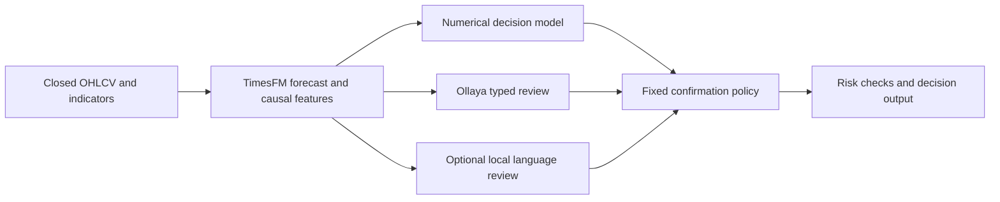

# Ollaya decision review

[Ollaya](https://github.com/ollaya-dev/ollaya) is a local runtime for open typed decision models, with choice, score and noul outputs. It is useful as a reviewer before consensus; the harness continues to own evidence timestamps, member policy, validation and risk. This integration does not replace TimesFM or the numerical decision layer.



See the [full architecture](architecture.md) for the request sequence and how this reviewer connects to risk and paper accounts.

## Setup

Install Ollaya using its own release instructions, then start its daemon in a separate terminal. The harness does not install or update the daemon, pull weights, or run an installer automatically.

```bash
ollaya serve
# In another terminal:
ollaya pull decision
pip install -e '.[orchestrator]'
OLLAYA_TIMEOUT_SECONDS=120 trade-harness decide --orchestrator-config examples/orchestrator-ollaya.json
# Add a reviewer alongside the current local adapter:
trade-harness decide --reviewers local-llm,ollaya
# Or configure CLI/API defaults through the environment:
export TRADING_ORCHESTRATOR_REVIEWERS=ollaya
trade-harness serve
```

`OLLAYA_BASE_URL` defaults to `http://127.0.0.1:11435`; `OLLAYA_MODEL` defaults to the concrete local name `decision:latest` (Decision 1.0 Eos, 0.8B, 16,384-token context). Models require separately downloaded weights and sufficient RAM. This selection is for context capacity, not established trading quality. You can explicitly select another concrete model, for example `OLLAYA_MODEL=winnow:e4b`, after pulling it. Only local names with an optional tag are supported; registry URLs and namespaces are not supported by this adapter. Router aliases such as `laya` are rejected if they resolve to a different model.

The small CPU `laya:en` model has a 512-token context. The real full-evidence smoke test exceeds that budget and returns an invalid vote. Use a longer-context model rather than silently dropping evidence. Failure, missing weights, truncation or invalid responses cause the orchestrator to abstain.

Set `OLLAYA_API_KEY` if the daemon requires authentication. Optional `OLLAYA_MODEL_DIGEST` pins the bare manifest SHA256 from `/api/tags`. The adapter records that digest in its version and vote details and checks it before each decision; a changed manifest requires a restart/new paper run. Keep the daemon's model store fixed during evaluation: this check is not a transaction locking the external store.

## Contract and score meaning

The adapter calls `/api/tags` and native `/api/decide`, using the normative [API contract](https://github.com/ollaya-dev/ollaya/blob/1b4398c0c291ab285d00222e3caa1920e6429ba8/docs/api.md), inspected with release v0.8.0. Native responses expose `state_truncated`, resolved `model`, and `done_reason`; all three are checked. No retries, implicit model pulls, text generation, or exchange order calls are involved. Metadata requests have a five-second timeout and inference has a thirty-second timeout by default. Set `OLLAYA_TIMEOUT_SECONDS` between 5 and 120 for slower CPU inference; exceeding the bound abstains. The real CPU smoke exceeded the default timeout on a cold Decision load, and a subsequent runner exited with SIGKILL. Full evidence inference can need substantial RAM or GPU resources; unloading Laya and using the 120-second bound then produced a successful full-evidence Decision review. Avoid retaining unused heavy models on memory-constrained hosts.

Each reviewer receives the shared forecast, strategy and engineered-feature evidence, recent closed market observations, and temporally valid prior decisions. It never receives the numerical anchor's direction or probabilities. Ollaya answers `direction` as BUY/SELL/HOLD and `evidence_sufficient` as a noul score. The latter is advisory and is recorded in `consensus.votes[].review_details`; it does not secretly change direction or the consensus denominator.

The selected choice probability is used as the existing harness confidence score. Ollaya's TypeSafe-compatible `confidence` is a different normalized-top-probability statistic and is not substituted. Its documented four-decimal probability rounding is normalized only within the documented 0.0005 total error; malformed distributions or choices that do not maximize probability are rejected. Financial probabilities remain labeled uncalibrated and research-only regardless of a model's general benchmark calibration.

Nimble served through Ollaya and the separate Nimble backend cannot count as two reviewers of the same model. Custom aliases can hide shared weights; configure genuinely distinct models when comparing reviewers. The default reviewer remains the existing local adapter until explicitly configured otherwise.

You can also use `--backend ollaya` as a standalone research proposal backend. This uses the shipped numerical model for return forecasts and Ollaya for direction; it does not have the orchestrator's consensus policy. Use the default orchestrator for layered decisions.

## Validation and distribution

Tests cover the native wire contract, shared evidence, confidence semantics, rounding, truncation, routing, malformed answers, stale forecasts, model manifest changes, and provenance in votes. [Actual smoke results](../reports/ollaya-smoke.json) include both failure cases and a real complete-evidence TimesFM/numerical/Decision review: both members returned HOLD, with the Ollaya vote at 0.8699 and identical evidence hashes. A smoke test establishes connectivity, not predictive quality. A dedicated chronological cost-aware ensemble evaluation is still needed before any positive-edge claim. No Ollaya model has been trading-fine-tuned here.

The daemon, model graphs, and weights remain separate from the harness wheel and its manual-only signing/update pipeline. This adapter adds no Python dependency beyond existing httpx; the usual orchestrator group is still needed for TimesFM and the local reviewer.
