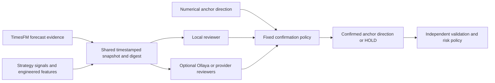
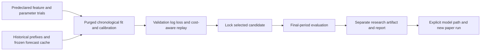

# Shared evidence and consensus experiments

The default `orchestrator` backend connects the trained hybrid numerical model with one to three language/typed decision reviewers. TimesFM provides forecast evidence; causal strategy and market features feed the numerical model; each language reviewer receives the same timestamped evidence independently. The orchestrator then applies a fixed confirmation policy, followed by the existing deterministic risk checks.

For the complete component map and request sequence, see [architecture and decision lifecycle](architecture.md). This guide focuses on reviewer configuration, consensus and offline experiments.

## Run locally

```bash
pip install -e '.[orchestrator]'
trade-harness decide --backend orchestrator --reviewers local-llm
TRADING_BACKEND=orchestrator trade-harness serve
```

This loads the existing hybrid artifact and the shipped SmolLM2 LoRA adapter. Pretrained TimesFM and SmolLM2 base weights download separately on first use. Allow several GB of RAM. The default local reviewer is trained only for BTCUSDT/1h/3-candle inputs; other contracts fail closed until a suitable reviewer is configured or trained. Use `--backend decision` to select the standalone numerical backend.

The local adapter's original training prompt did not contain TimesFM forecasts and strategy evidence. The extended prompt is therefore experimental and recorded as `extended_prompt_untrained`. Receiving evidence does not mean the language model has been fine-tuned to use it well. Its direction scores remain uncalibrated.

For the existing OpenAI-compatible reviewer, configure `LLM_MODEL`, `LLM_BASE_URL`, and `LLM_API_KEY`, then use `--reviewers llm`. This uses the existing Chat Completions JSON adapter, not a separately claimed OpenAI “Decisions API.” Other compatible providers can use this interface. No live paid-provider call was made during implementation; its shared-evidence contract is tested with mocked HTTP responses.

[Ollaya](ollaya.md) can supply a local typed reviewer through `--reviewers ollaya` or `--reviewers local-llm,ollaya`. The harness retains the consensus and risk policy.

The Nimble typed service accepts shared evidence through `--reviewers nimble`, using its existing configuration/credentials. Its review path uses the shared TimesFM forecast and omits numerical direction probabilities. A dedicated local server can review through `--reviewers llamafile`. Local LoRA and its llamafile runtime cannot both count as voters: they represent the same model family.

```bash
trade-harness decide --backend orchestrator --orchestrator-config examples/orchestrator.json
# With configured provider credentials:
trade-harness decide --backend orchestrator --reviewers local-llm,llm,nimble
```

The example policy uses unanimous agreement and a 0.55 minimum supporting score. Reviewer membership must be distinct; up to four total members include the mandatory numerical anchor. Reviewers run concurrently, each with an isolated snapshot/evidence copy and existing bounded provider timeouts. Provider initialization, transport, invalid output, and contract failures become audit statuses without leaking error details or credentials.

## What consensus means

Language reviewers do not receive the primary model's action or direction probabilities. They receive the closed market snapshot in their backend's supported format, matured prior history, and a common structured evidence object: TimesFM forecast, strategy hypotheses, and numerical feature values. Earlier feedback must have matured before the snapshot timestamp and match its symbol/timeframe.

The fixed `primary-confirmation-v1` policy confirms only the numerical model's own direction. A language majority cannot replace that direction. Every configured reviewer must return valid output; failed reviewers cannot silently shrink the denominator. Agreement must meet the configured fraction (greater than 50%, default 100%). Directional supporters must meet the policy's minimum score. Otherwise the proposal is HOLD with reason codes. SELL still exits a long; no short selling or real orders are enabled. Protective risk exits remain available when models fail.

The response contains `consensus.votes`, statuses, model versions, individual scores/probabilities, common evidence SHA256, configured/valid/supporting counts, and reasons. The aggregate has no action probability distribution: vote fractions and minimum supporting scores are heuristic policy measures. Models share inputs and can share errors; their votes are not independent statistical evidence. Direct provider-generated consensus claims are discarded by the harness.



| Numerical anchor | Reviewer result | Consensus outcome | Later risk decision |
| --- | --- | --- | --- |
| BUY, score 0.80 | BUY, score 0.70 | BUY under the default policy; aggregate score 0.70 | May still HOLD for missing edge, low net return or account limits |
| BUY | SELL | HOLD for insufficient agreement | Protective exits remain available for an existing long |
| BUY | Unavailable or invalid | HOLD; configured membership stays unchanged | No new simulated entry |
| SELL | SELL with adequate score | SELL confirmed | HOLD if there is no long to exit |
| HOLD, score 0.40 | HOLD, score 0.65 | HOLD accepted; directional score threshold does not apply | Ordinary harness confidence checks can still add a guard |

The aggregate retains the numerical anchor's `forecast`. The TimesFM input remains separately exposed as `forecast_evidence`; the two forecasts need not match. The original numerical action remains in its vote even if the orchestrator's `proposed_action` becomes HOLD.

The dashboard shows the member audit alongside separate forecasting and strategy evidence. All orchestrator decisions remain research-only. The primary model's validation is not inherited as validation of the ensemble.

## Feature and parameter experiments

```bash
trade-harness tune-hybrid \
  --forecast-cache artifacts/hybrid/forecasts.jsonl \
  --output reports/parameter-experiments.json \
  --model-output artifacts/hybrid/tuned-model.json

# Explicitly use the experimental artifact; use a new paper run ID:
TRADING_HYBRID_MODEL=artifacts/hybrid/tuned-model.json \
  trade-harness decide --backend orchestrator --reviewers local-llm
```



Two allowlisted, versioned recipes are available: the original 35-feature contract and four added interactions (forecast relative to volatility, uncertainty relative to ATR, forecast/trend alignment, and breakout/volume interaction). Ratios are bounded; no arbitrary generated Python is executed. Transformations are causal and identical during training and runtime. Standardization is fitted only on the training partition.

The default eight trials vary recipe, logistic regularization C (0.1/0.5), and Ridge regularization alpha (10/100). A custom `--trial-plan` accepts a JSON list with `name`, `features`, and `parameters`; two to sixteen trials are allowed. Names, recipe versions, and numeric parameter bounds are validated. This tunes the numerical decision layer, not TimesFM/LLM weights or live risk limits.

A plan/provenance file is written before trial evaluation. Reusing an output path with a different plan is rejected. Each trial uses three purged chronological folds, separate temperature calibration, identical sampled decision times, and normal/doubled-cost paper replay. Selection minimizes validation classification log loss; ties follow declared trial order. Ridge alpha affects return regression and risk outcomes, not classifier log loss. The final test evaluates only the locked winner and untuned base candidate, plus fixed-policy references. It never selects parameters.

The first eight trials modestly improved validation log loss with stronger regularization, but interactions did not help and every trial failed trading-edge gates. The selected artifact is shipped separately as `assets/tuned_hybrid_model.json`; it does not automatically replace the default hybrid artifact. See [measured parameter results](../reports/parameter-experiments.md).

Tuning seeks measured predictive/trading quality, not maximum agreement. Maximizing agreement alone could reward shared mistakes or constant HOLD. Existing history has already been examined; repeated trials require fresh prospective confirmation before any quality claim.

## Language-model fine-tuning data

Human-reviewed, matured feedback can be exported through the existing workflow:

```bash
trade-harness export-finetuning --db decisions.sqlite --output artifacts/reviewed-chat.jsonl
```

Orchestrator examples include their recorded forecast, strategy, and engineered feature evidence, with the snapshot digest checked against the vote audit. Realized future returns stay out of prompts; reviewed actions are targets. Consensus itself is not ground truth. The shipped language adapter was **not** retrained in this release; collecting and reviewing sufficient examples is a separate step before contextual LoRA fine-tuning. Exported generic chat examples can use the existing `scripts/train_lora.py` workflow; deployment must preserve the chosen model's prompt/output contract.

## Verification and limits

A real local CPU smoke test connected TimesFM, the numerical model, and the LoRA reviewer. They disagreed on the historical BTC snapshot, and the orchestrator abstained. A small later-than-known-training-cutoffs BTC audit measures agreement/direction behavior only; it is not a walk-forward edge test and contains no cost replay. See [audit results](../reports/consensus-comparison.json).

Tests cover member isolation, disagreement/failure abstention, quorum integrity, duplicate model-family rejection, score gates, temporal history, provider JSON contracts, forged consensus claims, feature serialization, and final-period changes leaving parameter selection unchanged. TimesFM 3.0's research-use restrictions remain applicable to its outputs. Signing and notarization remain manual-only; managed updates select the `orchestrator` dependency group when that backend is configured.
