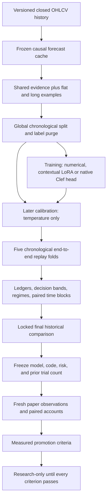

# Research, contextual training, and acceptance

The research workflow measures the complete decision policy: foundation forecast, numerical anchor, language review, consensus, risk checks, and simulated account outcomes. It saves abstentions and failures as well as trades. No report activates weights or enables real execution.



## Build realistic training examples

```bash
trade-harness export-research \
  --data-dir data/markets \
  --forecast-cache artifacts/hybrid/forecasts.jsonl \
  --output artifacts/research/examples-v2.jsonl

trade-harness train-language \
  --dataset artifacts/research/examples-v2.jsonl \
  --output artifacts/research/reviewer-v2 \
  --base-revision 12fd25f77366fa6b3b4b768ec3050bf629380bac \
  --steps 120 --eval-samples 48 --max-length 1536
```

Install `.[dev,orchestrator,llm-train]` first. The first export generates forecasts if the specified cache does not exist. Source files, context, stride, checkpoint, and cache inputs are checked. A changed forecast contract needs a separate cache. Dataset and adapter outputs are immutable; choose a new path for another experiment.

The split is global across assets: 50% training, 10% calibration, 20% validation, and 20% final test, based on unique timestamps. Every snapshot produces flat and long examples in the same partition. Labels that mature across a partition boundary are excluded. Both the user prompt and label are stored, with the label and future outcome outside the prompt.

Inputs contain observed market features, the uncertain foundation forecast, strategy hypotheses, position, and strictly past feedback. `shared-evidence-v2` uses exactly one renderer in training and inference. The renderer omits the numerical anchor's answer. A trained reviewer requires the same feature names, asset universe, timeframe, and horizon; it fails on mismatches or missing shared evidence. Evidence-mode metadata distinguishes trained contextual review from the original adapter's untrained extended prompt.

Labels use the next candle's open through the horizon close. For a flat position, BUY requires the estimated long return to exceed two-sided modeled fees/slippage plus minimum net edge; otherwise HOLD. For a long position, a sufficiently negative return produces SELL; otherwise HOLD. This distinguishes closing exposure from opening it. These are automatic outcome labels, not expert judgments, and do not model all intrabar stop/target paths. The full paper replay evaluates those paths separately.

Training masks all user/system tokens and rejects examples exceeding the token budget. A separate chronological calibration sample fits temperature after training. Calibration outcomes extend the reviewer's known fitting cutoff; later validation/test examples do not fit temperature. Class-return means use training outcomes only. Metadata records source hashes, revisions, processed samples, training budget, software versions, class counts, and held-out results.

Previous feedback in the automatic dataset follows a fixed historical trend hypothesis. End-to-end replay instead supplies each candidate's actual past paper decisions and matured outcomes. Their distribution can differ; the live history contract needs continued evaluation. Human-reviewed chat export remains available through `export-finetuning`; the generic chat trainer is a separate inference contract.

## Feature diagnostics and bounded searches

Feature diagnostics use training examples only, with paired positions counted once. Reports include forward-return Pearson and rank information coefficients by asset and regime. A seeded shuffle is an alignment check, not a significance test.

Regimes use existing causal thresholds: 20-candle return above +1%, below −1%, or range, combined with realized volatility above 1.5% or normal. Their definition is fixed before scoring. Validation/test regime summaries diagnose failures; they do not select new filters.

| Recipe | Features | Added representation |
|---|---:|---|
| `base` | 35 | Market, fixed strategy, and forecast evidence |
| `interactions` | 39 | Forecast/volatility, uncertainty/ATR, trend alignment, breakout/volume |
| `quant` | 45 | Also short/long volatility ratio, normalized momentum/range/body, and causal regime flags |

```bash
trade-harness tune-hybrid --folds 5 \
  --output reports/quant-experiments.json \
  --model-output artifacts/research/quant-hybrid.json
```

The default search has 12 declared recipe/regularization combinations. Reports retain every validation score, fold variation, and paired differences from the winner. The final period compares only the locked winner and untuned reference. Parameter surfaces and neighboring settings must support a finding; a tiny winning score does not establish edge. This search updates numerical weights only and never optimizes agreement for its own sake.

## Evaluate the whole policy

```bash
trade-harness evaluate-research \
  --dataset artifacts/research/examples-v2.jsonl \
  --reviewer-path artifacts/research/reviewer-v2 \
  --reviewers local-llm --folds 5 \
  --output artifacts/research/full-evaluation.json
```

The evaluator compares observed numerical features alone (22), observed features plus fixed strategies (30), the TimesFM/strategy hybrid (35), cash, fixed momentum and strategy policies, and every declared reviewer subset. This isolates the forecast contribution from the strategy contribution. All use identical decision timestamps and risk/cost settings. Each asset has an independent funded paper account. Normal and doubled-cost runs replay every intervening bar for next-open fills, stops, targets, horizon exits, account limits, and pending-order handling. Unscheduled bars update risk without creating synthetic HOLD entries in decision history. See the [completed comparison and new research tools](evidence-and-operations.md).

Numerical weights and calibration are fitted before each validation fold. Reviewers remain frozen and must declare a training cutoff earlier than the research validation period. Unknown-cutoff external services can still be runtime reviewers, but this evaluator refuses to certify their historical chronology. An explicit `--allow-unknown-cutoff --max-decisions N` permits only a bounded historical plumbing audit with chronology marked uncertified and promotion refused; it does not permit an unbounded certified benchmark. Member inference is cached using the exact input, history, shared evidence, and weight version; outcomes are excluded from cache keys and inference calls. Only harness-owned caches can mark a cache hit, and cached calls are excluded from provider timing.

Each replay writes a JSONL ledger and records its SHA256. Rows retain forecast/strategy/feature evidence, member votes, proposed and final actions, guardrails, costs/fill events, latency, and subsequently attached outcomes. Aggregate reports include per-class reliability, directional confidence bands, decision coverage, forecast error/interval coverage, and asset/regime summaries. An always-HOLD policy has zero directional coverage and cannot pass minimum evidence counts even if its classification accuracy looks high.

`--max-decisions N` declares a smaller timestamp sample **per interval**, before scoring. Such a report is a bounded operational audit; it does not represent the full decision schedule. The default uses every dataset timestamp. Final-test comparisons cannot choose a policy or claim fresh forward evidence.

Paired moving-block intervals resample contiguous blocks from aligned daily returns. Blocks span at least seven days and at least the forecast horizon when it is longer. Assets are aggregated at the same time before resampling, preserving cross-asset co-movement. Candidate-minus-momentum and candidate-minus-cash intervals are separate. At least 20 effective time blocks are required. Interval precision remains limited by dependence, regime shifts, and sample size; resampling creates no additional market evidence.

## Lock a fresh forward experiment

The declaration freezes the model identities, installed Python source digest, asset/timeframe/horizon universe, risk configuration, baseline choices, previous research-trial count, and evaluation endpoint. Generate it only after choosing a candidate and completing code changes. The current horizon requires a 140-day period. Promotion cannot occur before its endpoint, and later favorable observations cannot extend the same test.

```bash
trade-harness lock-research \
  --dataset artifacts/research/examples-v2.jsonl \
  --reviewer-path artifacts/research/reviewer-v2 \
  --reviewers local-llm --trial-count 32 \
  --output artifacts/research/forward-plan.json

# Set this explicitly for every collector; the declaration does not switch runtime weights.
TRADING_LORA_PATH=artifacts/research/reviewer-v2 trade-harness paper \
  --backend orchestrator --reviewers local-llm --research \
  --symbol BTCUSDT --steps 0 --poll-seconds 60 \
  --prospective-plan artifacts/research/forward-plan.json \
  --audit-output artifacts/research/forward-BTC.jsonl
```

The trial count is a declaration: replace the example with the complete count of prior searches, including rejected choices. The plan never turns historical observations into prospective ones. Its first eligible candle must close after both the declaration and the last examined market period. Separate collectors/journal files are needed for ETHUSDT and SOLUSDT using the same plan and reviewer; do not share one append-only file across concurrent processes.

Each collector uses deterministic plan-owned account IDs, preserves accounts across restarts, and runs momentum and doubled-cost accounts on the same market/quote stream. Code, model, or risk changes require a new declaration and funded accounts. The journal captures fresh observations before future labels are available and chains their hashes. Hash chaining detects alteration relative to a retained plan; it does not provide independent timestamp attestation.

After collecting future data, fetch the corresponding completed market bars into a separate outcome directory, then join matured labels:

```bash
trade-harness evaluate-forward \
  --prospective-plan artifacts/research/forward-plan.json \
  --input artifacts/research/forward-BTC.jsonl,artifacts/research/forward-ETH.jsonl,artifacts/research/forward-SOL.jsonl \
  --data-dir data/forward-markets \
  --output artifacts/research/forward-evaluation.json
```

The evaluator verifies journal chains and model/time/account identity. Outcomes are attached separately, leaving original predictions untouched. All planned assets must be observed, and at least 95% of expected candle decisions must be captured. It reports per-asset edge checks; an absent or losing asset cannot inherit a positive pooled result. Only completed, predeclared windows count toward the five-window requirement. Windows span 28 days for the current three-hour horizon, and grow for longer horizons.

## Acceptance criteria

`research-promotion-v2` adds mandatory forward evidence to legacy historical gates. Passing requires all of:

- A locked declaration and a genuinely later evaluation period, completed through its fixed endpoint, with predictions recorded before outcomes and unchanged model/code/risk choices.
- Recorded prior searches, coverage of every planned asset, and at least 95% observation coverage.
- At least 95% coverage of matured outcome labels and three completed windows with at least 30 directional observations and acceptable calibration in each.
- At least five completed chronological windows, 100 closed trades, and three positive windows.
- Positive normal and doubled-cost returns, plus positive lower bounds for candidate-versus-momentum and candidate-versus-cash intervals.
- At least 20 effective seven-day time blocks and per-asset positive/stressed/interval checks with at least 20 closed trades per asset.
- At least 100 directional predictions, 30 observations in every populated decision-confidence bin, and directional calibration error no greater than 0.10.
- Probability calibration fitted on earlier data; heuristic consensus confidence cannot claim calibrated probability.

Historical model artifacts without accepted forward evidence remain `research_only`, even when old historical gates pass. Supplied status/boolean claims cannot override measured failures. Promotion evidence must match the model version, fold/trade counts, and evaluation endpoint. No workflow automatically inserts forward results into runtime model artifacts or replaces weights.

The present TimesFM pipeline retains its documented [research use restrictions](timesfm.md). Live paper capture is available for appropriately licensed forecasting/model configurations; a numerical gate does not grant production rights. The project continues to return decisions and simulate accounts without exchange order execution.
